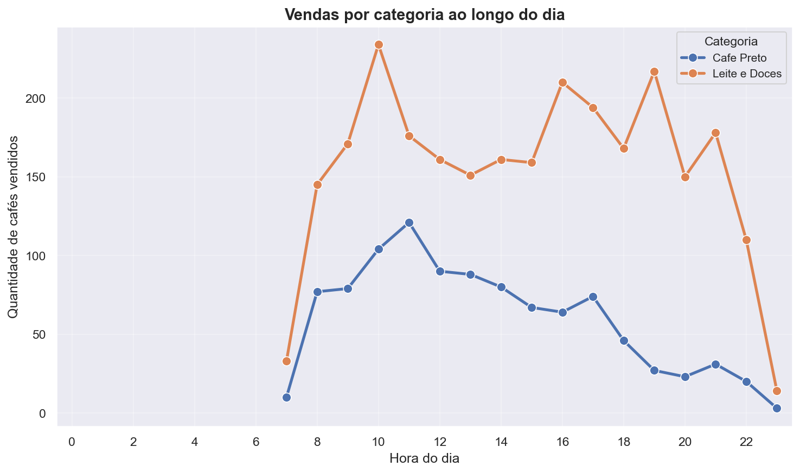
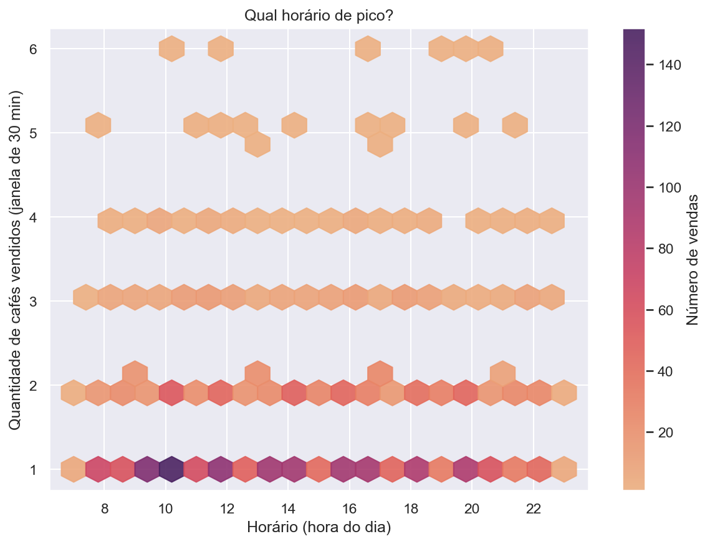
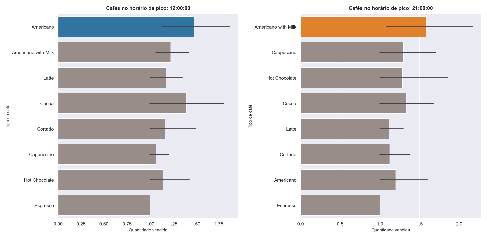
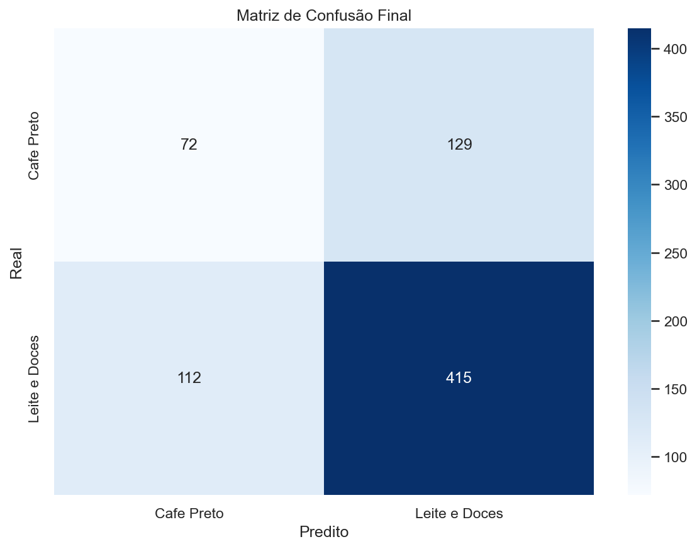
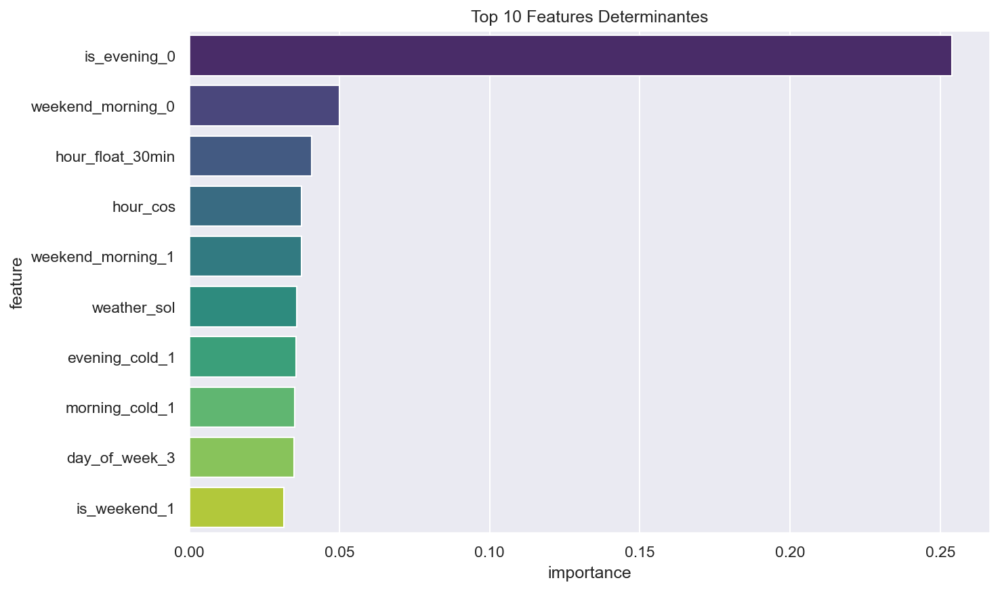

# análise de predição de café

## resumo

análise de dados de vendas de café com dois modelos de machine learning para predição de categorias de café baseado em características temporais, climáticas e de pagamento.

## modelos treinados

### modelo 1: classificação binária

**algoritmo**: xgboost classifier com randomized search cv

**objetivo**: classificar entre "café preto" e "leite e doces"

**características**:

- preprocessamento: one-hot encoding (categóricas) e standard scaler (numéricas)
- balanceamento: resampling para lidar com desbalanceamento
- otimização: randomized search cv com 15 iterações

**métricas**:

- accuracy: 68%
- precision (café preto): 43%
- precision (leite e doces): 78%
- recall (café preto): 43%
- recall (leite e doces): 78%

**features principais**:

- hora do dia (representação cíclica sin/cos)
- período do dia (manhã/tarde/noite)
- condições climáticas
- interações temporais e climáticas

### modelo 2: classificação hierárquica

**algoritmo**: dois modelos xgboost em cascata

**objetivo**: classificar entre três categorias (chocolate quente, café com leite, café preto)

**arquitetura**:

1. primeiro nível: modelo_choc classifica se é "chocolate quente" ou não
2. segundo nível: modelo_milk classifica entre "café com leite" e "café preto" (apenas para não-chocolate)

**características**:

- balanceamento: sample weights para lidar com classes desbalanceadas
- parâmetros: max_depth=4, learning_rate=0.05, n_estimators=300

**vantagens**:

- abordagem hierárquica simplifica o problema multiclasse
- melhor performance em categorias minoritárias

## visualizações

### análise exploratória

**vendas por horário**



gráfico de linha mostrando distribuição de vendas por categoria de café (café preto vs leite e doces) ao longo do dia. agrupa os tipos individuais em categorias para melhor visualização e identifica padrões de consumo e picos de demanda.

**horário de pico**



visualização hexbin mostrando concentração de vendas por horário. identifica períodos de maior movimento e ajuda a entender a distribuição temporal das vendas.

**cafés no horário de pico**



gráficos de barras comparando vendas por tipo nos horários de maior movimento. mostra preferências durante períodos de alta demanda, útil para planejamento de estoque.

### avaliação dos modelos

**matriz de confusão**



mostra performance do modelo na classificação. diagonal principal indica acertos, fora da diagonal mostra erros de classificação. útil para identificar quais categorias são mais difíceis de prever.

**top 10 features determinantes**



gráfico de barras horizontal com features mais importantes ordenado por feature importance do xgboost. ajuda a entender quais fatores mais influenciam a escolha do café.

## estrutura do projeto

```
coffee-prediction-analysis/
├── data/
│   ├── coffee_cleaned.csv
│   └── model_trained_coffee.csv
├── notebooks/
│   ├── 01_exploratory_data_analysis.ipynb
│   ├── 02_model_training.ipynb
│   └── 03_recommendation_system.ipynb
└── images/
    ├── vendas_por_horario.png
    ├── horario_pico.png
    ├── cafes_pico.png
    ├── matriz_confusao.png
    └── features_importantes.png
```

## resultados

o modelo 1 (binário) alcança 68% de acurácia, sendo mais preciso para "leite e doces" (78%) do que para "café preto" (43%). o modelo 2 (hierárquico) oferece uma abordagem alternativa para classificação multiclasse, potencialmente melhorando a performance em categorias minoritárias através da decomposição do problema.
